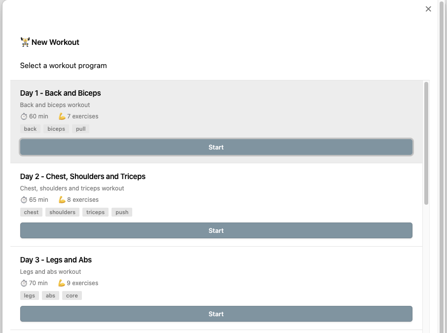
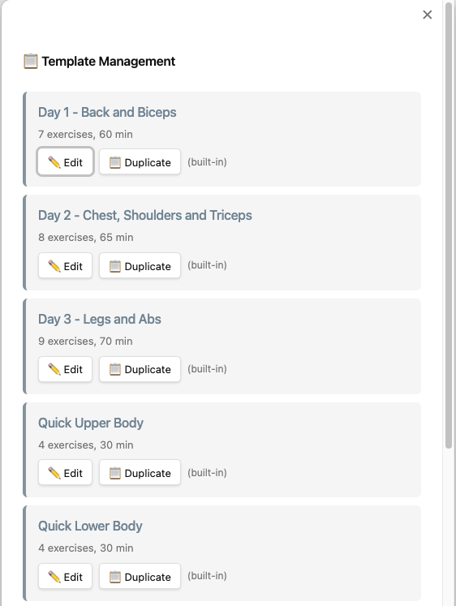
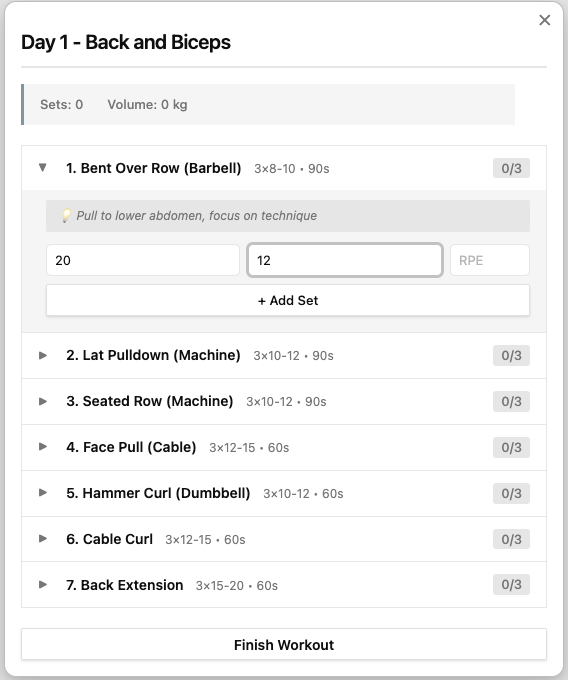

# 🏋️ Workout AI Tracker for Obsidian

Advanced workout tracking plugin for Obsidian with AI-powered analysis using Claude API.

## ✨ Features

### 📝 Workout Tracking

- ✅ **Template-based workouts** - Select from 5 default templates or create custom ones
- ✅ Quick workout entry with modal interface
- ✅ Track weight, reps, RPE, heart rate for each set
- ✅ Warmup/cooldown cardio activities (elliptical, rowing, etc.)
- ✅ Automatic markdown file generation with Obsidian Base properties
- ✅ Organized in customizable folder structure
- ✅ Progress tracking within workout (exercise X of Y)

### ⏱️ Built-in Tools

- ✅ Rest timer with countdown and notifications
- ✅ Quick add exercise to today's workout
- ✅ Progressive volume and set tracking
- ✅ Duration tracking

### 🤖 AI-Powered Analysis

- ✅ Claude API integration for intelligent workout analysis
- ✅ Progress tracking (weights, reps, volume)
- ✅ Program recommendations
- ✅ Recovery analysis
- ✅ Imbalance detection
- ✅ Personalized training advice

### 📊 Data Organization

- ✅ Uses Obsidian Base (properties in frontmatter)
- ✅ Markdown files for full-text search
- ✅ Git-friendly version control
- ✅ No external dependencies

Below are some screenshots of the app in action:

### New Workout Selection



### Template Management



### Workout Session



## 🚀 Installation

### Manual Installation

1. Download the latest release
2. Extract files to `.obsidian/plugins/workout-ai-tracker/` in your vault
3. Reload Obsidian
4. Enable "Workout AI Tracker" in Settings → Community Plugins

### From Source

```bash
git clone https://github.com/yourusername/obsidian-workout-ai
cd obsidian-workout-ai
npm install
npm run build
```

Copy `main.js`, `manifest.json`, and `styles.css` to your vault's plugins folder.

## ⚙️ Setup

### 1. Get Claude API Key

1. Go to https://console.anthropic.com/
2. Create an account or sign in
3. Generate an API key
4. Copy the key (starts with `sk-ant-...`)

### 2. Configure Plugin

1. Open Obsidian Settings
2. Go to Workout AI Tracker
3. Paste your Claude API key
4. Set your workouts folder (default: `Workouts`)
5. Configure default rest time (default: 90 seconds)

## 📖 Usage

### Starting a Workout

**Method 1: Ribbon Icon**

- Click the 🏋️ icon in the left ribbon
- Select a template from the list (Day 1, Day 2, Day 3, Quick Upper, Quick Lower)
- Click "Start" to begin the workout with pre-configured exercises
- Or click "Create Empty Workout" for a custom workout

**Method 2: Command Palette**

- Press `Cmd/Ctrl + P`
- Type "Start new workout"
- Press Enter
- Select your template

**Method 3: Hotkey** (configure in settings)

- Set custom hotkey for "Start new workout"

### Using Workout Templates

The plugin comes with 5 default templates based on your optimized training program:

1. **Day 1 - Back and Biceps** (60 min, 7 exercises)

   - Back and biceps focused workout
   - Includes Bent Over Row, Lat Pulldown, Seated Row, Face Pull, Hammer Curl, Cable Curl, Back Extension

2. **Day 2 - Chest, Shoulders and Triceps** (65 min, 8 exercises)

   - Chest, shoulders, and triceps
   - Includes Bench Press, Incline Press, Overhead Press, Lateral Raise, Reverse Fly, Tricep Pushdown

3. **Day 3 - Legs and Abs** (70 min, 9 exercises)

   - Legs and abs
   - Includes Goblet Squat, Leg Press, Romanian Deadlift, Bulgarian Split Squat, Leg Curl, Calf Raise, Abs exercises

4. **Quick Upper Body** (30 min, 4 exercises)

   - Fast upper body workout
   - Push-ups, Pull-ups, Overhead Press, Dumbbell Row

5. **Quick Lower Body** (30 min, 4 exercises)
   - Fast lower body workout
   - Goblet Squat, Lunges, Romanian Deadlift, Calf Raises

**Managing Templates:**

- Press `Cmd/Ctrl + P` and type "Manage workout templates"
- **✏️ Edit** any template (default or custom):
  - Default templates: Creates a new custom copy when saved
  - Custom templates: Updates the existing template
- **➕ Create** new templates from scratch with the "+" button
- **📋 Duplicate** templates to create variations
- **🗑️ Delete** custom templates (default templates are protected)
- Custom templates are saved in plugin data.json (persistent, synced with vault)

**Template Editor Features:**

- Edit template name, description, and tags
- Add/remove/reorder exercises within the template
- Configure sets, reps range (min-max), and rest time for each exercise
- Set target weights as suggestions for exercises
- Add exercise notes (technique tips, progression advice)
- Set estimated workout duration
- Enable/disable warmup and cooldown (with duration)
- Save validates that name and at least one exercise are present

### Tracking Exercises

When using a template, the plugin guides you through each exercise:

1. **Current Exercise Info** - Shows exercise name, target sets/reps, rest time, and notes
2. **Set Counter** - Displays which set you're on (e.g., "Set 2 of 3")
3. **Input Weight and Reps** - Enter the weight (kg) and repetitions completed
4. **Optional Fields** - Add RPE (1-10) and heart rate if desired
5. **Add Set** - Click to record the set
6. **Progress Automatically** - Plugin moves to next set or exercise
7. **Skip Exercise** - Option to skip if needed
8. **View Completed** - See summary of all completed sets
9. **Finish Workout** - Save to markdown file when done

**Template-Free Workouts:**

- Choose "Create Empty Workout" for custom workouts
- Manually enter each exercise name as you go
- Add sets one at a time with full flexibility

### Using Rest Timer

- After completing a set, press `Cmd/Ctrl + P`
- Type "Start rest timer"
- Timer countdown begins
- Skip anytime or wait for completion

### AI Analysis

**Analyze Recent Workouts:**

1. Open any note
2. Press `Cmd/Ctrl + P`
3. Type "Analyze workouts with AI"
4. Wait for AI analysis
5. Analysis inserted into current note

**What AI Analyzes:**

- 📈 Progress trends (weight/reps/volume)
- 💡 Program recommendations
- 😴 Recovery assessment
- ⚖️ Muscle group imbalances
- 🎯 Specific next-workout advice

## 📁 File Format

### Generated Workout File

```markdown
---
date: 2025-11-08
program: Day 1 - Back and Biceps
duration: 45
totalSets: 18
totalVolume: 2450
type: workout
---

# Day 1 - Back and Biceps

📅 2025-11-08 | ⏱️ 45 min | 💪 18 sets | 📊 2450 kg volume

## 🏃 Warmup

- **Type:** Elliptical
- **Duration:** 10 min
- **Resistance:** 7
- **Incline:** 8
- **Average HR:** 118 bpm

## 💪 Exercises

### Bent Over Row (Barbell)

| Set | Weight (kg) | Reps | RPE | HR | Rest (sec) |
| --- | ----------- | ---- | --- | --- | ---------- |
| 1   | 20          | 12   | 7   | 135 | 90         |
| 2   | 20          | 12   | 8   | 138 | 90         |
| 3   | 20          | 12   | 9   | 142 | 90         |

### Lat Pulldown (Machine)

| Set | Weight (kg) | Reps | RPE | HR | Rest (sec) |
| --- | ----------- | ---- | --- | --- | ---------- |
| 1   | 40          | 12   | 7   | 130 | 90         |
| 2   | 40          | 12   | 8   | 133 | 90         |
| 3   | 40          | 11   | 9   | 137 | 90         |

## 🏃 Cooldown

- **Type:** Elliptical
- **Duration:** 10 min
- **Resistance:** 7
- **Incline:** 8
- **Average HR:** 115 bpm

## 📝 Notes

Great workout! Feeling progress on rows.
```

### Obsidian Base Properties

Properties automatically added to frontmatter:

- `date` - Workout date (YYYY-MM-DD)
- `program` - Program name
- `duration` - Total minutes
- `totalSets` - Number of sets completed
- `totalVolume` - Total kg lifted (weight × reps)
- `type` - Always "workout" for filtering

### Querying with Dataview

```dataview
TABLE duration, totalSets, totalVolume
FROM "Workouts"
WHERE type = "workout"
SORT date DESC
LIMIT 10
```

```dataview
TABLE WITHOUT ID
  date as "Date",
  duration as "Duration (min)",
  totalVolume as "Volume (kg)"
FROM "Workouts"
WHERE program = "Day 1 - Back and Biceps"
SORT date DESC
```

## 🎨 Customization

### Custom CSS

Add to your vault's `.obsidian/snippets/workout-custom.css`:

```css
/* Custom workout card styling */
.exercise-item {
  background: linear-gradient(135deg, #667eea 0%, #764ba2 100%);
  color: white;
}

/* Timer styling */
.timer-display {
  color: #ff6b6b;
  font-size: 96px;
}
```

## 🔧 Advanced Usage

### Templates

Create a template in `Templates/Workout Template.md`:

```markdown
---
date: { { date } }
program: { { title } }
type: workout
---

# {{title}}

## Warmup

- [ ] 10 min elliptical

## Exercises

- [ ] Exercise 1
- [ ] Exercise 2

## Cooldown

- [ ] 10 min elliptical
```

### Dataview Dashboards

Create `Workouts Dashboard.md`:

````markdown
# 🏋️ Workout Dashboard

## This Week

```dataview
LIST duration + " min"
FROM "Workouts"
WHERE type = "workout" AND date >= date(today) - dur(7 days)
SORT date DESC
```

## Total Volume by Program

```dataview
TABLE WITHOUT ID
  program as "Program",
  sum(totalVolume) as "Total Volume (kg)",
  count(rows) as "Sessions"
FROM "Workouts"
WHERE type = "workout"
GROUP BY program
```

## Recent PRs

```dataview
TABLE date, program, totalVolume
FROM "Workouts"
WHERE type = "workout"
SORT totalVolume DESC
LIMIT 5
```
````

## 🤝 Contributing

Contributions welcome! Please:

1. Fork the repository
2. Create a feature branch
3. Make your changes
4. Submit a pull request

## 📄 License

MIT License - see LICENSE file for details

## 🙏 Acknowledgments

- Obsidian team for amazing plugin API
- Anthropic for Claude API
- Community plugin developers for inspiration

## 🐛 Bug Reports

Report issues at: https://github.com/yourusername/obsidian-workout-ai/issues

## 📮 Support

- GitHub Discussions: Ask questions and share ideas
- Email: your@email.com

---

**Made with 💪 for the Obsidian community**
